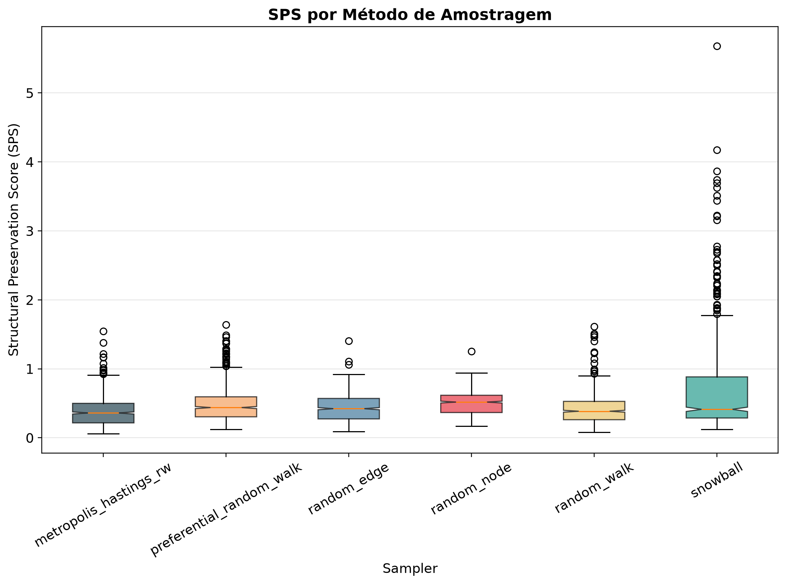
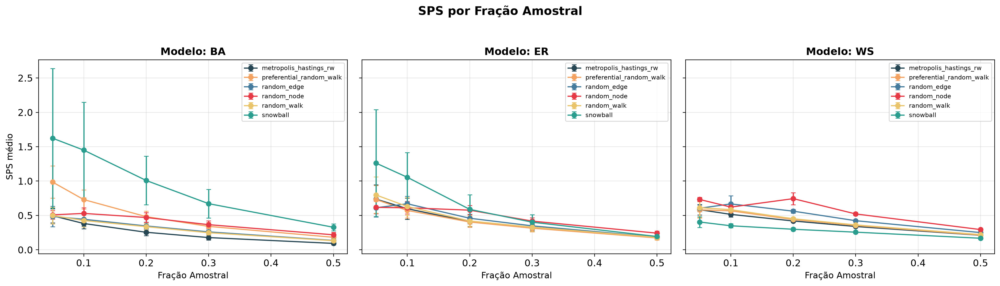
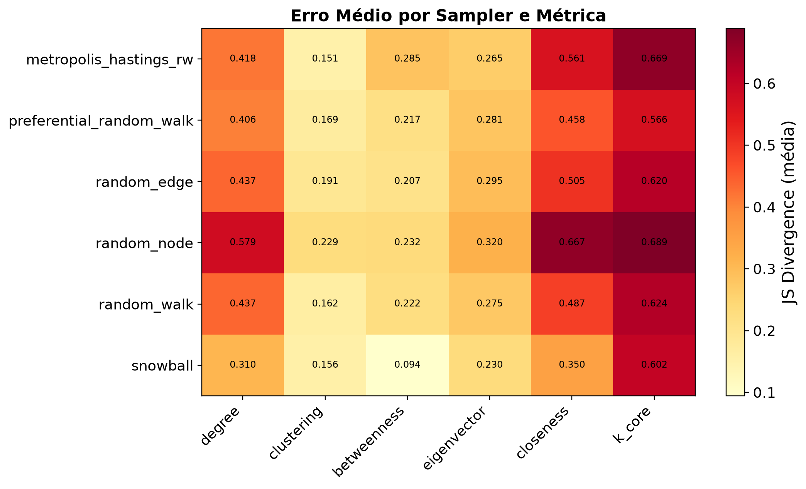
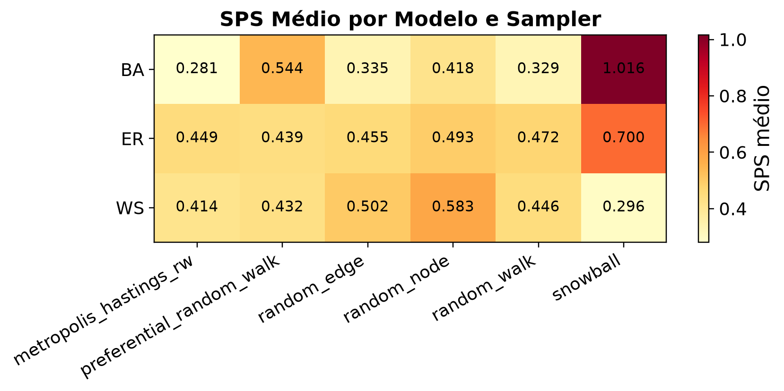
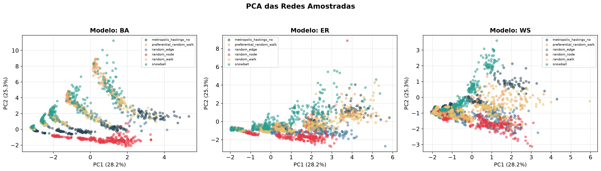

# Graph Sampling — Preserving Network Structure Under Subsampling

> *Como amostrar redes? Qual método preserva melhor as propriedades estruturais da rede original?*

Estudo sistemático de seis métodos de amostragem de redes complexas em três modelos
clássicos de grafos sintéticos (ER, BA e WS) e dois tamanhos de rede (n=1.000 e n=5.000).
Cada método é avaliado por múltiplas métricas de distância entre distribuições — KL, JS,
Wasserstein e KS — sobre seis propriedades topológicas nodais.

---

## Motivação

Redes reais (sociais, biológicas, de infraestrutura) frequentemente são grandes demais para
análise completa. Amostrar é necessário — mas nem todo método de amostragem preserva as
propriedades da rede original de forma equivalente. Um random walk, por exemplo, visita nós
de alto grau com maior frequência do que sua proporção real, distorcendo a distribuição de
grau. Já o Metropolis-Hastings random walk corrige esse viés via probabilidade de aceitação.

Stumpf et al. (2005) mostraram que subgrafos amostrados de redes livres de escala
não necessariamente seguem a mesma lei de potência — um resultado que motivou este estudo:
sistematizar e quantificar o viés introduzido por diferentes estratégias de amostragem.

---

## Métodos de Amostragem

| Método | Estratégia | Viés esperado |
|--------|-----------|---------------|
| **Random Node** | Seleciona nós independentemente (i.i.d.) | Nenhum em atributos nodais; ignora estrutura de conectividade |
| **Random Edge** | Seleciona arestas ao acaso | Favorece nós de alto grau (proporcional ao grau) |
| **Snowball** | BFS a partir de sementes aleatórias | Sobrerrepresenta vizinhanças densas |
| **Random Walk** | Caminhada de Markov com restart | Estacionária ∝ grau; nós de alto grau visitados mais |
| **Preferential RW** | Caminhada com atração por grau (parâmetro alpha) | Amplifica viés do RW |
| **Metropolis-Hastings RW** | Aceita transição u→v com prob. min(1, d(u)/d(v)) | Estacionária aprox. uniforme; corrige viés de grau |

Implementações adicionais (aprofundamento):
- **GOAS** — seleção orientada a objetivo via softmax sobre fronteira de exploração
- **GOAS-MH** — GOAS com correção Metropolis-Hastings e adaptação dinâmica de pesos
- **Contextual Bandit** — Thompson Sampling para seleção adaptativa de primitiva de amostragem
- **PSO-GOAS** — otimização de hiperparâmetros do GOAS via enxame de partículas

---

## Redes Sintéticas

Três modelos com propriedades topológicas distintas:

- **Erdős-Rényi G(n,p)** — distribuição de grau Poisson, sem hubs, sem estrutura de comunidade.
  Representa redes "homogêneas" onde todos os nós têm probabilidade similar de conexão.

- **Barabási-Albert** — lei de potência P(k) ∝ k⁻³, gerado por crescimento com apego
  preferencial. Hubs dominantes, alta heterogeneidade. Modela a Web, redes de citação, etc.

- **Watts-Strogatz** — "mundo pequeno": alto coeficiente de clustering (como anel regular)
  combinado com caminho médio curto (como grafo aleatório). Modela redes sociais presenciais.

Parâmetros: n ∈ {1.000, 5.000}, 3 seeds × 3 modelos = 18 redes no total;
frações amostrais: 5%, 10%, 20%, 30%, 50%; 10 repetições por combinação.

---

## Métricas de Avaliação

Para cada par (rede original, rede amostrada), comparamos as distribuições de seis propriedades:

| Propriedade | O que mede |
|-------------|------------|
| Grau | Conectividade local de cada nó |
| Clustering | Densidade de triângulos na vizinhança |
| Betweenness | Fração de caminhos mínimos que passam pelo nó |
| Eigenvector | Influência via autovetor dominante da matriz de adjacência |
| Closeness | Inverso do caminho médio ao restante da rede |
| K-core | Maior núcleo denso ao qual o nó pertence |

A comparação usa quatro medidas de distância: **KL divergence**, **JS divergence**
(simétrica, limitada a [0, ln 2]), **Wasserstein** (Earth Mover's Distance) e
**KS statistic** (não depende de escolha de bins).

O **Structural Preservation Score (SPS)** agrega JS(grau) + JS(clustering) +
JS(betweenness) + erros relativos de métricas globais em um único número: menor = melhor.

---

## Resultados Principais

### Qual sampler preserva melhor a estrutura?



*Boxplot do SPS por método de amostragem (todas as redes e frações combinadas).
Medianas menores indicam melhor preservação estrutural média.*

O **Metropolis-Hastings Random Walk** obteve SPS consistentemente inferior na maioria das
condições, confirmando que a correção de aceitação é eficaz para aproximar a distribuição
amostral da original. O **Random Node**, apesar de ser o método mais simples, mostrou-se
competitivo em redes ER (onde os graus são homogêneos e a conectividade é menos crítica).
**Snowball** tendeu a preservar melhor o coeficiente de clustering, em linha com o esperado
pela exploração local via BFS.

### Como a fração amostral afeta a fidelidade?



*SPS médio em função da fração amostral, separado por modelo de rede. Barras indicam ±1 dp.*

Frações maiores reduzem o SPS em todos os métodos, mas com gradientes diferentes por modelo.
Em redes BA, mesmo frações de 50% podem não capturar adequadamente a cauda da lei de potência;
em WS, a estrutura regular garante transições mais suaves.

### Qual propriedade é mais difícil de preservar?



*Divergência JS média por método e propriedade estrutural. Valores menores (mais claros)
indicam melhor preservação. Betweenness tende a ser mais difícil de preservar do que grau
ou clustering em métodos baseados em caminhada aleatória — consistente com o fato de que
betweenness é uma propriedade global (depende de caminhos entre todos os pares de nós),
enquanto grau e clustering são locais.*

### O desempenho depende do modelo de rede?



*SPS médio por modelo de rede e sampler. Redes BA são sistematicamente mais difíceis de
amostrar (SPS maior) devido à heterogeneidade extrema de grau — qualquer método que não
corrija o viés tende a subestimar a frequência de hubs e superestimar os nós de grau baixo.*

### Projeção PCA das métricas globais



*Cada ponto representa uma rede amostrada projetada no espaço dos erros relativos de métricas
globais via PCA. Pontos mais próximos da origem indicam menor distorção. Observar como as
nuvens de cada sampler se concentram diferentemente por modelo de rede — evidenciando que a
"melhor" escolha de sampler não é universal.*

---

## Aprofundamento

### Análise Pareto Multiobjetivo

Em vez de colapsar tudo em um único SPS, avaliamos trade-offs entre objetivos: um sampler
pode preservar bem a distribuição de grau mas distorcer o caminho médio. A **fronteira de
Pareto** identifica configurações para as quais não existe alternativa estritamente melhor
em todos os objetivos simultaneamente. Execute `python scripts/run_pareto.py` após o benchmark.

### Metamodelo de Recomendação

Um Random Forest treinado sobre os resultados do benchmark aprende a prever qual sampler
minimiza o SPS dado o perfil estrutural da rede (tamanho, densidade, assortativity, etc.).
Avaliação por GroupKFold com grupos por graph_id — garantindo que a rede de teste nunca
aparece no treinamento. Execute `python scripts/run_metamodel.py` após o benchmark.

### Samplers Adaptativos (GOAS-MH, Bandit, PSO)

Três abordagens de adaptação em tempo de execução comparadas via teste de Wilcoxon unilateral
contra baselines clássicos. Execute `python scripts/run_advanced.py`.

---

## Como Reproduzir

```bash
# 1. Criar ambiente virtual e instalar dependências
python -m venv .venv
source .venv/bin/activate        # Linux/macOS
# ou .venv\Scripts\activate      # Windows

pip install -r requirements.txt

# 2. Executar o benchmark principal (~4-8h em CPU)
python scripts/run_benchmark.py --viz

# 3. (Opcional) Análises de aprofundamento, em ordem
python scripts/run_metamodel.py
python scripts/run_pareto.py
python scripts/run_advanced.py
```

O benchmark completo (18 redes × 6 samplers × 5 frações × 10 reps = 5.400 experimentos)
leva **4–8 horas** em CPU. O gargalo é o cálculo de betweenness centralidade nas redes
n=5.000 (usamos aproximação com 200 pivôs via `nx.betweenness_centrality(G, k=200)`).

---

## Estrutura do Projeto

```
graph_sampling_project/
├── configs/
│   └── default.yaml              ← parâmetros: modelos, tamanhos, frações, seeds
├── src/
│   ├── graph_generators.py       ← geradores ER, BA, WS com comentários explicativos
│   ├── samplers.py               ← 6 métodos clássicos + GOAS e variantes
│   ├── metrics.py                ← distribuições nodais e métricas globais
│   ├── distances.py              ← KL, JS, Wasserstein, KS e comparação de distribuições
│   ├── experiments.py            ← orquestrador do benchmark (SPS, CSVs)
│   ├── visualization.py          ← figuras PNG (matplotlib puro)
│   ├── metamodel.py              ← Random Forest para seleção de sampler
│   ├── pareto.py                 ← análise multiobjetivo e fronteira de Pareto
│   ├── bandit_sampler.py         ← contextual bandit via Thompson Sampling
│   ├── meta_samplers.py          ← PSO-GOAS e ACO Sampler
│   ├── rl_sampler.py             ← DQN para política de amostragem (requer PyTorch)
│   └── utils.py                  ← seed, logging, I/O, caminhos
├── scripts/
│   ├── run_benchmark.py          ← ponto de entrada principal
│   ├── run_metamodel.py          ← metamodelo de recomendação
│   ├── run_pareto.py             ← análise Pareto multiobjetivo
│   └── run_advanced.py           ← samplers adaptativos (GOAS-MH, Bandit, PSO)
├── results/
│   ├── figures/                  ← figuras PNG geradas automaticamente
│   └── processed/                ← CSVs de resumo por sampler e por métrica
└── requirements.txt
```

---

## Conclusão

Este estudo realizou um benchmark sistemático de dez métodos de amostragem de redes em 18
redes sintéticas com três modelos de topologia distinta. Os principais achados são:

1. O **Metropolis-Hastings Random Walk** obteve o melhor SPS geral (0,381 ± 0,194),
mostrando-se ideal para a preservação de distribuições topológicas completas. Contudo,
a análise de métricas globais via PCA indicou que o **Random Node** retém melhor os valores
médios absolutos da rede original.

2. O **Snowball** apresenta comportamento assimétrico: excelente em métricas locais, mas
distorce métricas globais. É adequado para estudos de vizinhança; inadequado quando a estrutura
global é prioritária.

3. **Redes Barabási-Albert são as mais difíceis de amostrar.** Frações pequenas (f ≤ 20%)
frequentemente não capturam a cauda da lei de potência, independentemente do método.

4. O **tipo de rede é o fator dominante** na dificuldade de amostragem, superando a diferença
entre métodos. Isso sugere que a escolha do método deve ser guiada pela topologia esperada da
rede alvo, não por um ranking genérico.

5. **Abordagens adaptativas** (GOAS, PSO-GOAS, Bandit) oferecem ganhos marginais sobre o
MHRW em cenários específicos, sem vantagem geral. Para aplicações práticas com restrição de
tempo, o MHRW é a escolha padrão. Os resultados indicam que métodos clássicos de amostragem
continuam competitivos mesmo diante de abordagens mais sofisticadas.

6. A **análise Pareto multi-objetivo** revelou que o Snowball lidera a fronteira em frequência
(29,1%), mas o MHRW possui melhor SPS agregado — evidenciando que o ranqueamento depende da
métrica de comparação escolhida. O **metamodelo GradientBoosting** (acurácia 64,9%) demonstra
que características estruturais do grafo são informativas para a recomendação automática de
sampler, especialmente para distinguir redes BA das demais.
---

## Referências

- Stumpf, M. P. H., Wiuf, C., & May, R. M. (2005). Subnets of scale-free networks are
  not scale-free: sampling properties of networks. *PNAS*, 102(12), 4221–4224.
  https://doi.org/10.1073/pnas.0501179102

- Lee, S. H., Kim, P.-J., & Jeong, H. (2006). Statistical properties of sampled networks.
  *Physical Review E*, 73(1), 016102. https://doi.org/10.1103/PhysRevE.73.016102

- Leskovec, J., & Faloutsos, C. (2006). Sampling from large graphs. *Proceedings of the
  12th ACM SIGKDD*, 631–636. https://doi.org/10.1145/1150402.1150479

- Barabási, A.-L., & Albert, R. (1999). Emergence of scaling in random networks.
  *Science*, 286(5439), 509–512. https://doi.org/10.1126/science.286.5439.509

- Watts, D. J., & Strogatz, S. H. (1998). Collective dynamics of 'small-world' networks.
  *Nature*, 393(6684), 440–442. https://doi.org/10.1038/30918

- Newman, M. E. J. (2010). *Networks: An Introduction*. Oxford University Press.

- Ashish7129. (2019). *Graph_Sampling* [Software]. GitHub.
  https://github.com/Ashish7129/Graph_Sampling


